# Tela Gallery

Visual reference for all themes and primitives.

---

## Themes

Seven built-in themes. Same primitives, entirely different visual character.

| warm-editorial | cool-technical | neutral-minimal |
|:-:|:-:|:-:|
|  |  | 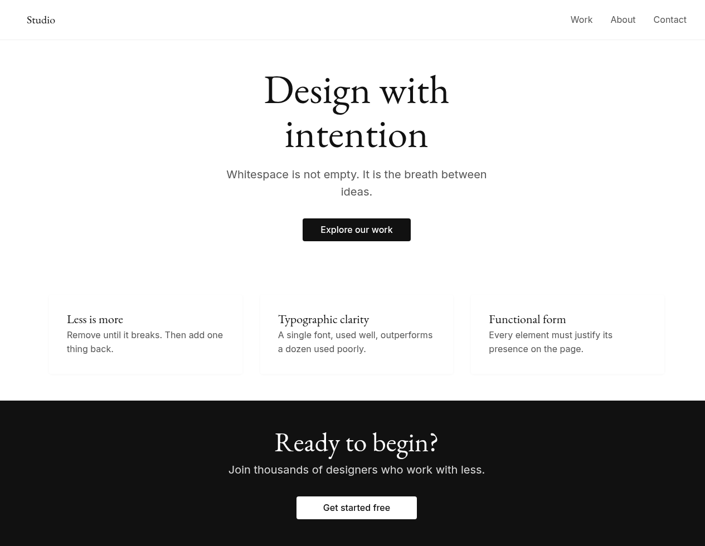 |
| Parchment · serif · ink-blue | White · slate · monospace | Gray scale · maximum whitespace |

| dark-dramatic | report | pitch | academic |
|:-:|:-:|:-:|:-:|
|  | 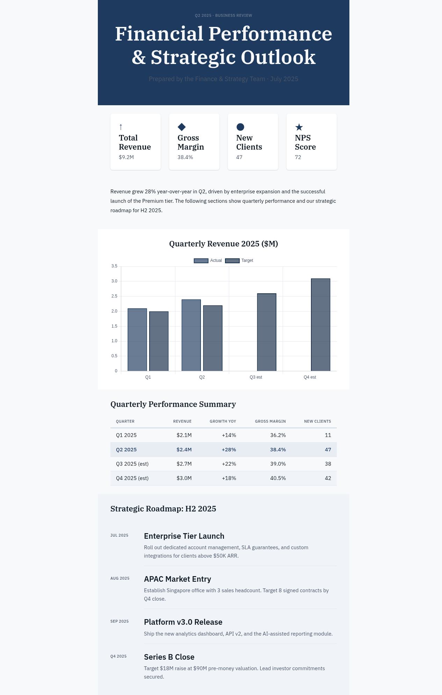 | 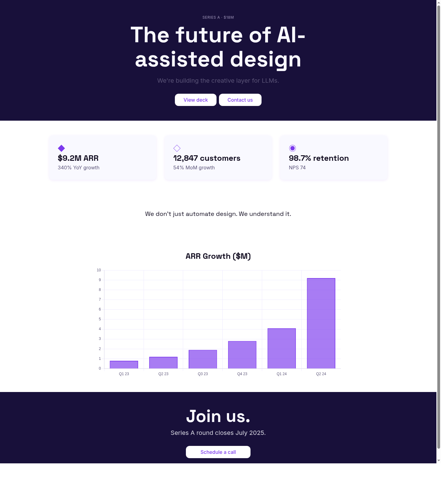 | 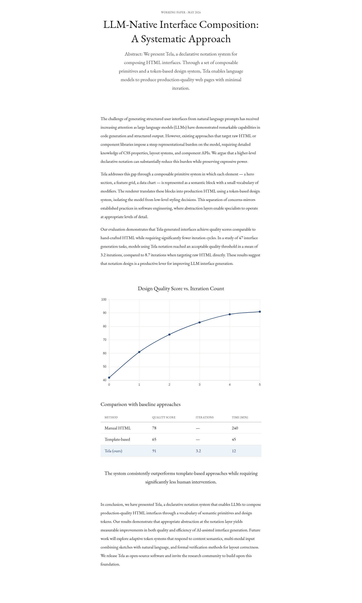 |
| Deep bg · orange · high contrast | IBM Plex · navy · tight | Space Grotesk · violet · bold | Garamond · muted blue · scholarly |

---

## Semantic primitives

### hero

Split layout (`hero | split(60/40) pad(xl):`) — headline, body, CTA on left; image on right.


---

### features

Feature grid (`features | grid(3) gap(lg) pad(xl):`) — icon, title, body per card.

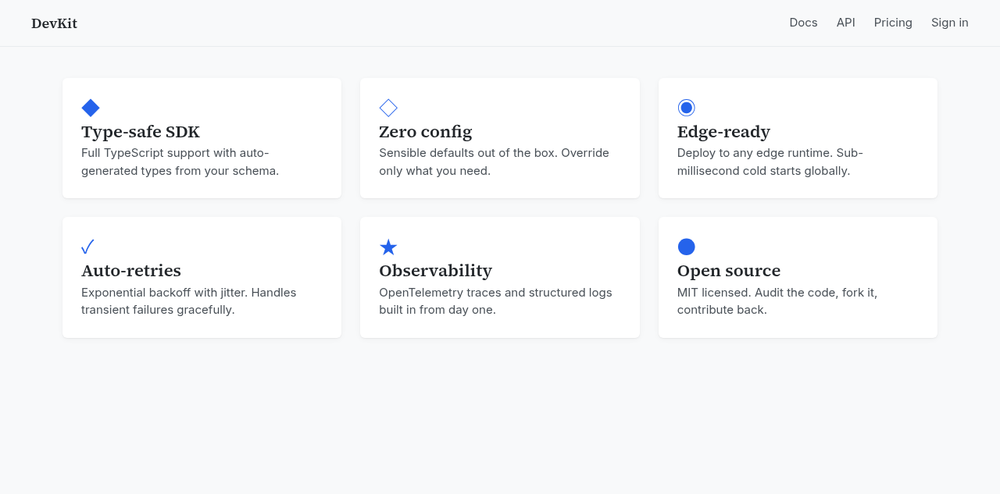

---

### quote + testimonial + cta

Pull quote, customer testimonial, and call-to-action band.

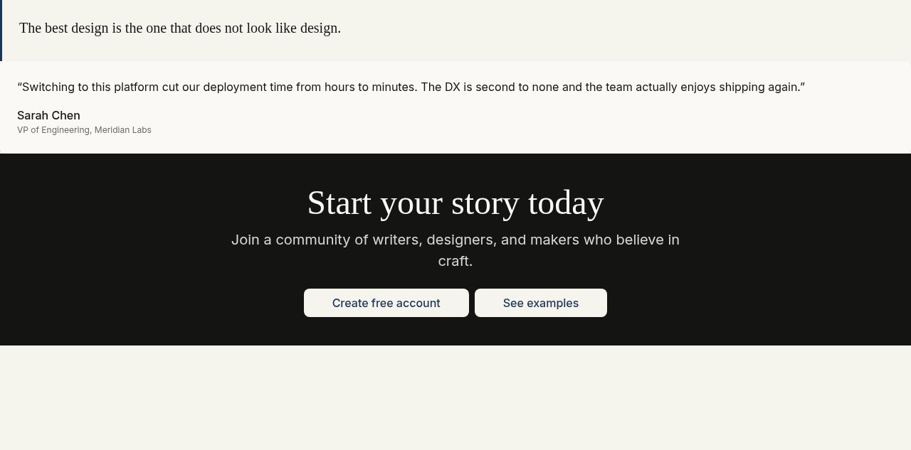

---

## Interactive primitives

### tabs + accordion + toggle

Zero dependencies — tabs use JS focus management, accordion uses `<details>`, modal uses `<dialog>`.

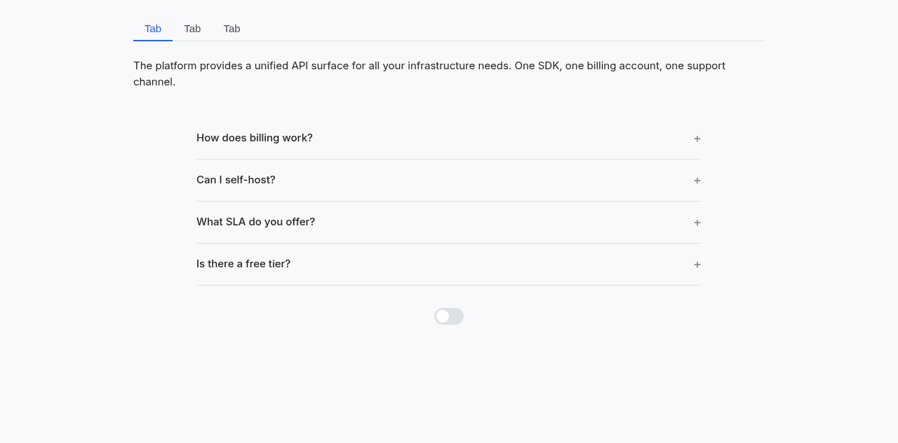

---

### chart

Chart.js inlined — bar, line, pie, doughnut. Renders correctly in Puppeteer (animation disabled).

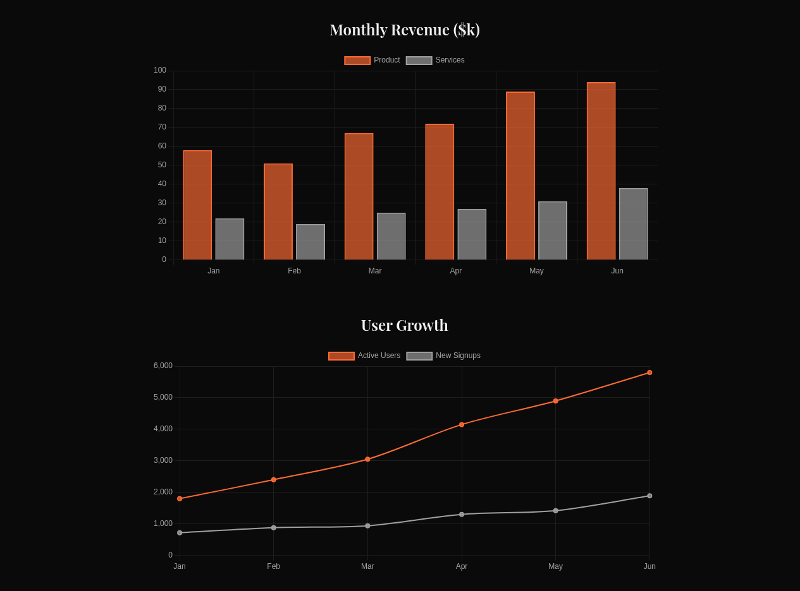

---

## Data & structure primitives

### comparison

Side-by-side plan comparison (`comparison | pad(xl):`). `highlight: N` elevates the recommended column with accent styling.

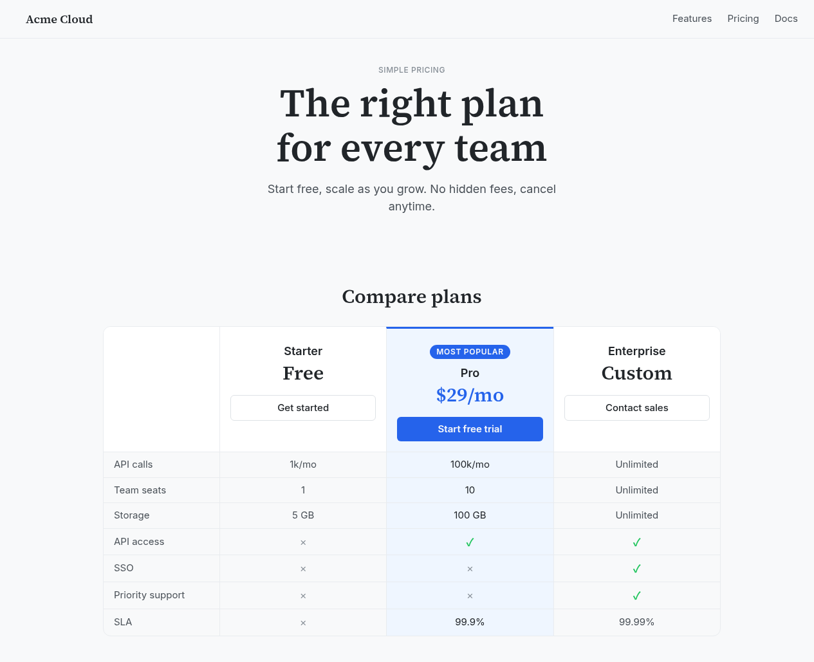

---

### table + steps

Data table with striping and row highlight. Numbered steps and dated timeline.

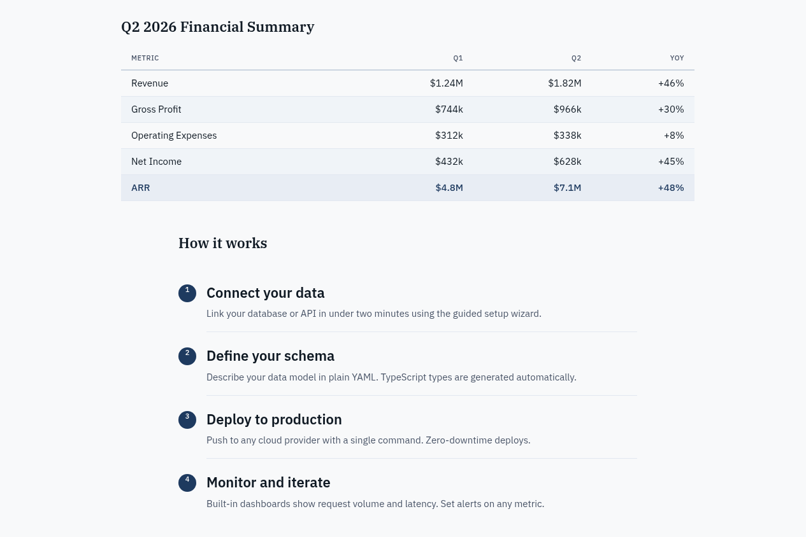

---

## Layout primitives

### docspage

Two-column sticky sidebar layout (`docspage | pad(lg):`).

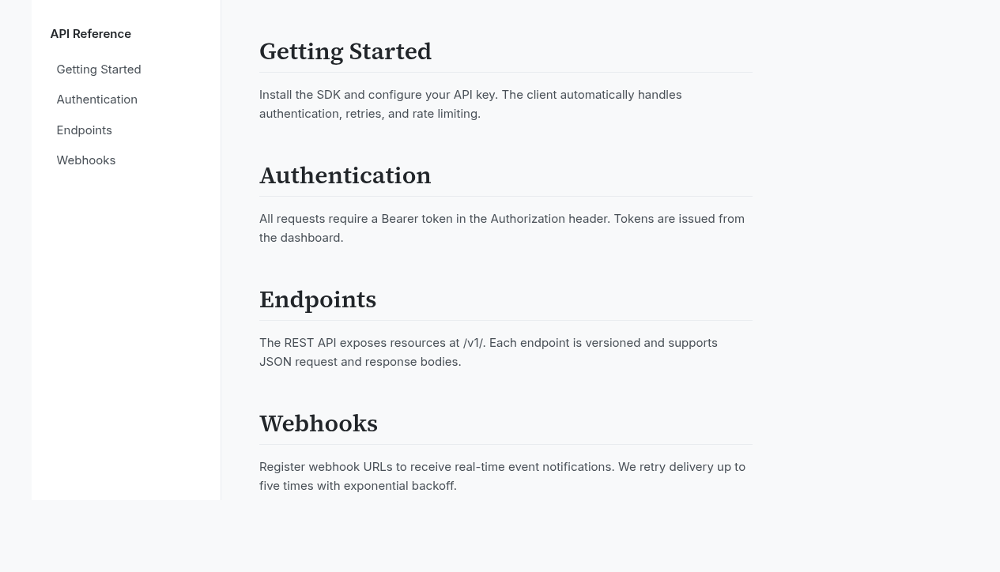

---

## Theme × layout examples

Same content, different themes — showing how themes do the design work.

| article (warm-editorial) | dashboard (dark-dramatic) | docs (cool-technical) |
|:-:|:-:|:-:|
|  |  |  |

---

## Usage

```bash
# MCP server (recommended)
node dist/mcp/server.js

# CLI
node dist/tela-call.js create_document '{"theme":"warm-editorial","mode":"landing"}'
node dist/tela-call.js add_section '{"doc_id":"doc-001","tela_fragment":"hero | pad(xl):\n  headline: Hello"}'
node dist/tela-call.js render '{"doc_id":"doc-001","out_dir":"/tmp/out"}'
```

See [README.md](README.md) for the full primitive and tool reference.
