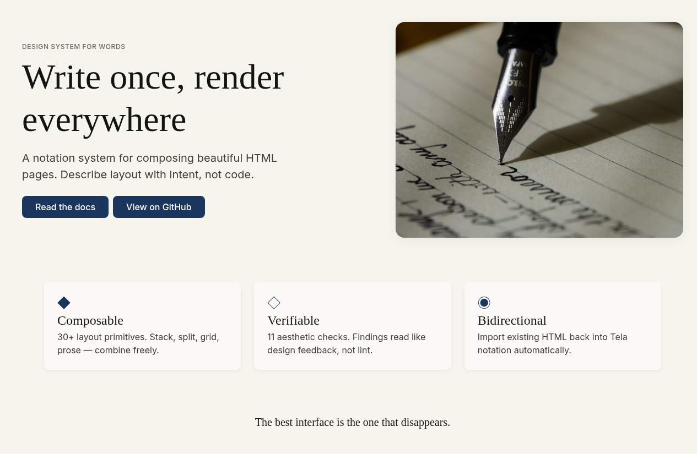
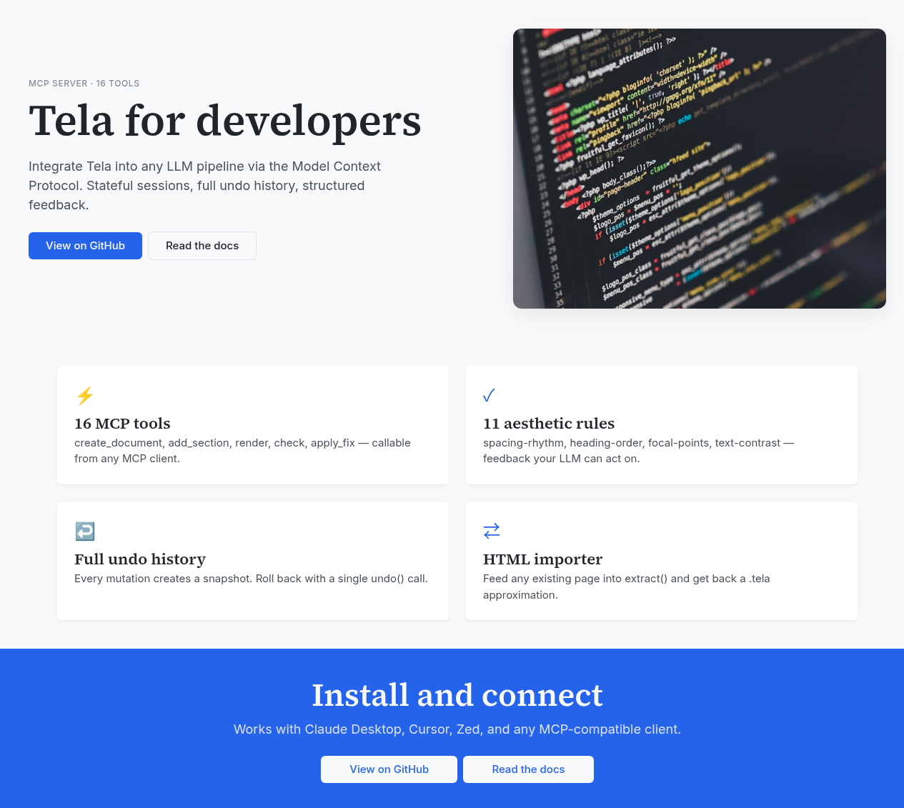
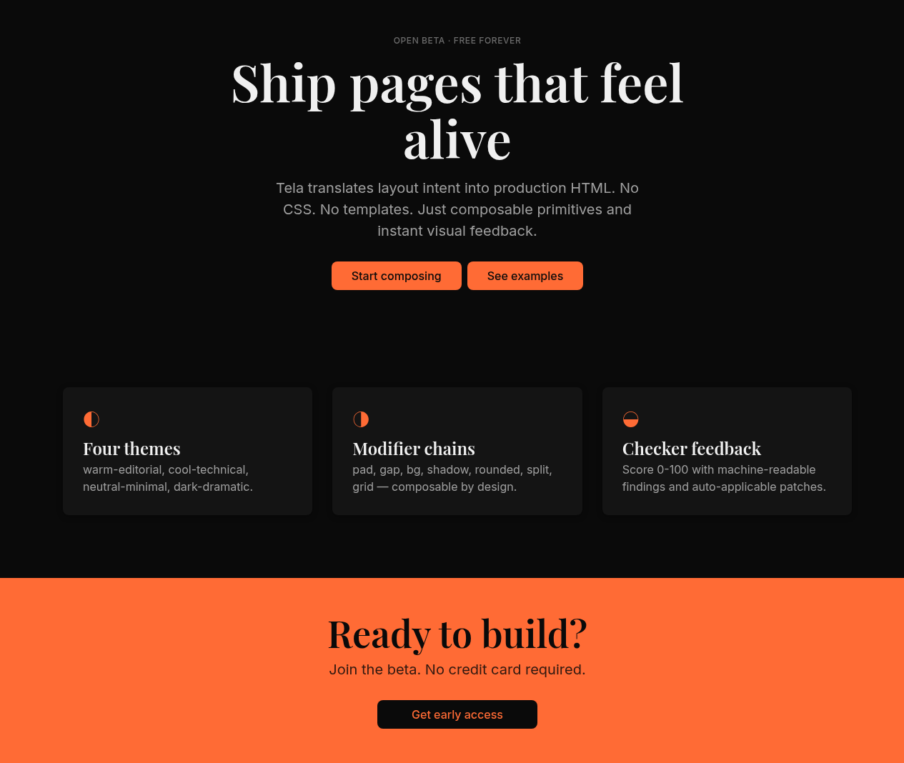
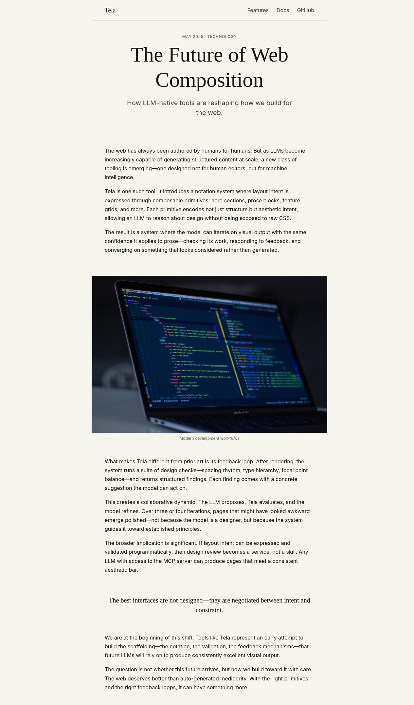
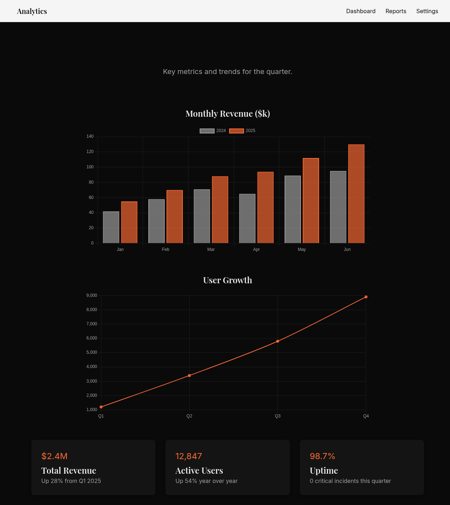
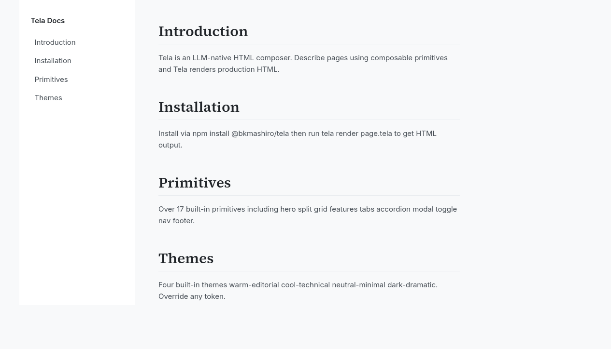

# Tela

**LLM-native HTML page composer — layout primitives, interactive components, multi-page sites.**

LLMs describe pages using composable primitives. Tela renders them to production HTML, validates aesthetics, and feeds back structured guidance so the LLM can iterate.

```
create_document() → add_section() × N → render() → check() → update_section() → render()
```

---

## Examples

Five examples across themes and modes:

| warm-editorial | cool-technical | dark-dramatic |
|:-:|:-:|:-:|
|  |  |  |
| Parchment · Serif · Editorial | White · Slate · Developer | Dark · High contrast · Bold |

| article (warm-editorial) | dashboard + charts (dark-dramatic) |
|:-:|:-:|
|  |  |
| Long-form editorial with prose, figure, pull-quote | Sticky nav · bar/line charts · stat cards |

| docs layout (cool-technical) |
|:-:|
|  |
| Two-column sticky sidebar · docs mode |

---

## How it works

Instead of writing HTML or CSS, an LLM declares intent using Tela's notation — typed sections with modifier chains. Tela handles the translation, validates the result against aesthetic rules, and returns machine-readable feedback the LLM can act on immediately.

````
---
theme: warm-editorial
mode: landing
---

nav | sticky:
  logo: Tela
  links:
    - label: Features | href(#features)
    - label: Docs     | href(/docs)
    - label: GitHub   | href(https://github.com/bkmashiro/tela) role(ghost)

---

hero | split(60/40) pad(xl):
  left:
    eyebrow: "v1.0 · Now in beta"
    headline: |
      Make something
      worth reading
    body: Tela composes pages from layout primitives.
    cta:
      - label: Get started  | role(primary)
      - label: See examples | role(ghost)
  right:
    figure: ./hero.png | aspect(4/3) rounded shadow(lg)

---

features | grid(3) gap(lg):
  - icon: ◆ | accent
    title: Composable
    body: 30+ primitives. Combine freely.
  - icon: ◇ | accent
    title: Verifiable
    body: Checks read like design feedback.
  - icon: ◉ | accent
    title: Interactive
    body: Tabs, accordions, modals — zero dependencies.

---

tabs | pad(lg):
  items:
    - title: Overview
      body: Tela renders layout intent to production HTML. No CSS. No templates.
    - title: API
      body: 16 MCP tools. create_document, add_section, render, check — all callable from any MCP client.
    - title: Themes
      body: warm-editorial, cool-technical, neutral-minimal, dark-dramatic.

---

accordion | pad(md):
  items:
    - question: Is Tela free?
      answer: Yes, MIT licensed.
    - question: Does it require a framework?
      answer: No. Pure HTML + CSS + minimal vanilla JS. Zero runtime dependencies.

---

cta | centered pad(xl):
  headline: Ready to build?
  body: Join the beta. No credit card required.
  cta:
    - label: Get early access | role(primary)
````

**Syntax:**
- `---` separates sections (also wraps frontmatter)
- `type | mod1 mod2(arg):` declares a block with modifiers
- `mod(arg)` = modifier with argument; `mod` = boolean flag
- Indentation expresses child structure (YAML semantics)
- `#` for comments

---

## Primitives

### Semantic sections

| Primitive | Description |
|-----------|-------------|
| `hero` | Page header with headline, body, CTA — supports `split(60/40)` layout |
| `features` | Grid of feature cards |
| `quote` | Pull quote or blockquote |
| `testimonial` | Customer quote with attribution |
| `prose` | Single-column reading view |
| `figure` | Image with aspect ratio, shadow, rounding |
| `gallery` | Multi-image grid |
| `cta` | Call-to-action band |
| `aside` | Callout / info box |
| `divider` | Horizontal rule |
| `nav` | Navigation bar — sticky, responsive, hamburger menu |
| `footer` | Page footer with links |

### Interactive components

Zero dependencies — all interactivity is inline vanilla JS + scoped CSS.

| Primitive | Description |
|-----------|-------------|
| `tabs` | Tabbed content, ARIA-compliant, vanilla JS click handler |
| `accordion` | Collapsible FAQ using `<details>`/`<summary>` — works without JS |
| `modal` | Dialog overlay via native `<dialog>` + `showModal()` |
| `toggle` | Styled checkbox toggle, animates via CSS |
| `chart` | Chart.js opt-in — bar, line, pie, doughnut — single or multi-dataset |

### Layout containers

| Primitive | Description |
|-----------|-------------|
| `stack` | Vertical flex flow |
| `split` | Horizontal split with configurable ratio |
| `grid(n)` | n-column CSS grid |
| `centered` | Horizontally centered container |
| `docspage` | Two-column sticky-sidebar docs layout — sidebar nav + scrollable main content |

### Modifiers

`pad(xs|sm|md|lg|xl|section)` · `gap(xs|sm|md|lg|xl)` · `bg(token)` · `rounded` · `shadow(sm|md|lg)` · `bleed` · `aspect(w/h)` · `accent` · `muted` · `inverted` · `sticky` · `centered` · `split(n/m)` · `grid(n)` · `role(primary|ghost|danger)` · `href(url)` · `trigger("label")` · `label("text")`

---

## Design Tokens

All visual decisions flow through a semantic token tree — no raw CSS values in notation:

```
color.surface.default / elevated / warm / inverted
color.text.primary / secondary / caption / accent
color.border.subtle / default / strong
color.accent.default / tint / shade

space.xs=4 / sm=8 / md=16 / lg=24 / xl=40 / section=80

type.scale.caption=12 / body=16 / lead=20 / h3=24 / h2=32 / h1=48 / display=64
type.leading.tight=1.2 / default=1.5 / loose=1.7

elevation.flat / raised / floating
radius.sm=4 / md=8 / lg=16 / xl=24 / pill=999
```

**Four built-in themes:**

| Theme | Character |
|-------|-----------|
| `warm-editorial` | Parchment background, ink-blue accent, serif headline |
| `cool-technical` | White, slate accent, monospace emphasis |
| `neutral-minimal` | Gray scale only, maximum whitespace |
| `dark-dramatic` | Deep background, high contrast, bright accent |

**Override syntax:**
```yaml
theme: warm-editorial + color.accent.default=#C84B31
```

---

## Multi-page Sites

Group documents into a named site and render them together with correct cross-page link resolution:

```
create_site("My Site", theme="warm-editorial")   → site_id
add_page(site_id, slug="index",   doc_id=home_doc)
add_page(site_id, slug="docs",    doc_id=docs_doc)
add_page(site_id, slug="about",   doc_id=about_doc)
render_site(site_id, out_dir="./dist")
```

Output structure:
```
dist/
  index.html          ← slug "index"
  docs/index.html     ← slug "docs"
  about/index.html    ← slug "about"
```

Site-relative links (`href(/docs)`) resolve automatically relative to each page's location.

---

## MCP Server

Tela runs as an MCP server. Connect any MCP client and use tools to create, edit, render, and check documents in a stateful session with full undo history.

**Document lifecycle:**
```
create_document(theme?, mode?, lang?)   → doc_id
open_document(path)                     → doc_id
save_document(doc_id, path?)            → saved_path
list_documents()                        → [{id, mode, section_count}]
undo(doc_id)                            → restored snapshot
```

**Section editing:**
```
add_section(doc_id, tela_fragment, position?)
update_section(doc_id, section_id, tela_fragment)
remove_section(doc_id, section_id)
reorder_sections(doc_id, section_ids[])
set_theme(doc_id, theme_spec)
```

**Fine-grained editing:**
```
get_section(doc_id, section_id)           → annotated tela fragment
update_block(doc_id, path, props)         # path: "hero.left.cta[0].label"
```

**Multi-page sites:**
```
create_site(name, theme?)               → site_id
add_page(site_id, slug, doc_id)
remove_page(site_id, slug)
render_site(site_id, out_dir)           → {outputDir, pages[]}
list_pages(site_id)                     → [{slug, docId}]
list_sites()                            → [{id, name, pages[]}]
```

**Render + check loop:**
```
render(doc_id)                → {html_path, screenshot_path}
check(doc_id)                 → CheckReport JSON
apply_fix(doc_id, fix_id)     → auto-apply checker suggestion
```

**Discovery:**
```
list_components()             → block registry + example tela
list_themes()                 → theme presets
list_modifiers()              → modifier vocabulary + valid values
```

---

## Checker

Feedback reads like design guidance, not lint output. Every finding includes a concrete fix the LLM (or `apply_fix`) can act on immediately.

```json
{
  "score": 74,
  "summary": "Hero hierarchy clear; rhythm and focal-point issues in features",
  "checks": [
    {
      "id": "spacing-rhythm.001",
      "severity": "warning",
      "rule": "spacing-rhythm",
      "location": "section[1].grid",
      "finding": "gap(16px) conflicts with base unit (24px). Creates visual dissonance.",
      "fix": "Change gap modifier to lg or xl"
    },
    {
      "id": "focal-points.001",
      "severity": "warning",
      "rule": "focal-points",
      "location": "section[0].hero",
      "finding": "3 elements compete for primary attention: headline, figure, dual-CTA.",
      "fix": "Remove ghost CTA from hero; place in a dedicated section below"
    }
  ]
}
```

**11 check rules:** `unfilled-slots` · `heading-order` · `alt-text` · `line-length` · `type-scale` · `text-contrast` · `spacing-rhythm` · `whitespace-balance` · `focal-points` · `cta-placement` · `grid-consistency`

---

## Typical LLM Workflow

```
list_components()
create_document(theme="warm-editorial", mode="landing")
add_section(doc, "nav | sticky: ...")
add_section(doc, "hero | split(60/40) pad(xl): ...")
add_section(doc, "features | grid(3) gap(lg): ...")
add_section(doc, "tabs | pad(lg): ...")
add_section(doc, "cta | centered pad(xl): ...")
render(doc)                # → {html_path, screenshot_path}
check(doc)                 # → CheckReport
apply_fix(doc, "spacing-rhythm.001")
render(doc)                # → updated screenshot
save_document(doc, "./landing.tela")
```

---

## Architecture

```
src/
  ast/          # TypeScript AST type definitions
  parser/       # .tela notation → AST
  tokens/       # token resolution + 4 theme presets
  renderer/     # AST → HTML+CSS (section-granular, incremental)
  primitives/   # built-in block library (17 components)
  checker/      # CheckReport engine (11 rules)
  extractor/    # existing HTML → .tela approximation
  mcp/          # DocumentStore + SiteStore + MCP server (22 tools)
  cli/          # tela render / check / extract
```

---

## Status

| Phase | Package | Status |
|-------|---------|--------|
| 0 | `ast` — typed AST definitions | ✅ complete |
| 1 | `tokens` — token system, 4 theme presets | ✅ complete |
| 2 | `parser` — .tela → AST | ✅ complete |
| 3 | `renderer` — AST → HTML+CSS, incremental | ✅ complete |
| 4 | `primitives` — 17 built-in components | ✅ complete |
| 4 | `mcp` — DocumentStore + SiteStore, 22 tools, history/undo | ✅ complete |
| 4 | `interactive` — tabs, accordion, modal, toggle | ✅ complete |
| 5 | `checker` — CheckReport, 11 rules, fix patches | 🔜 next |
| 6 | Screenshot — Puppeteer integration | 🔜 next |
| 7 | `extractor` — HTML → .tela | 🔜 next |
| 8 | `apply_fix` — auto-patch from fix_id | 🔜 next |

**103 tests passing. Zero TypeScript errors.**

---

## License

MIT
